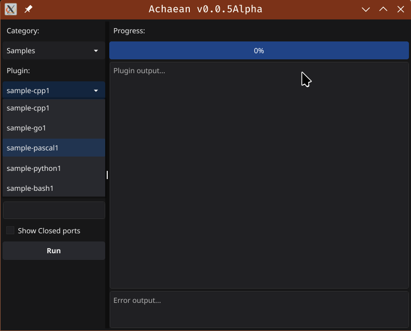
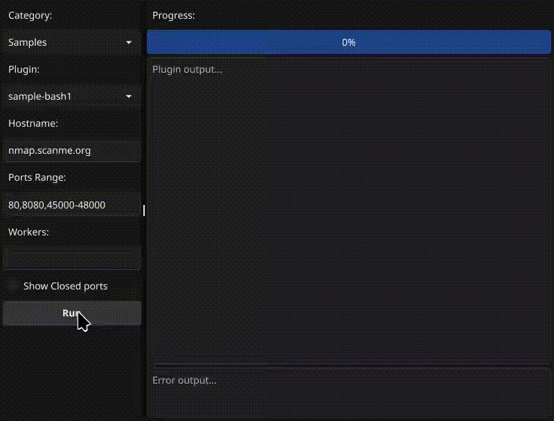
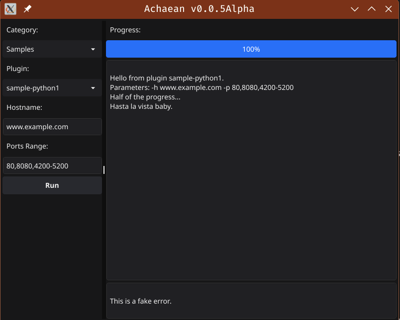

# Achaean

Graphical and CLI interface for selecting, configuring, and running security tools as plugins, handling input/output streams, and monitoring execution progress in real-time. Support plugins in any language.

The project in a `very Alpha state`. 

## Plugin samples
Under `data/plugins` you can see some plugins in Bash, C++, Go, Pascal & Python as well an a README file (in Spanish at the moment) about how to create one.

## Some screenshots

Selecting a plugin...

Bash plugin running

Bash python running
